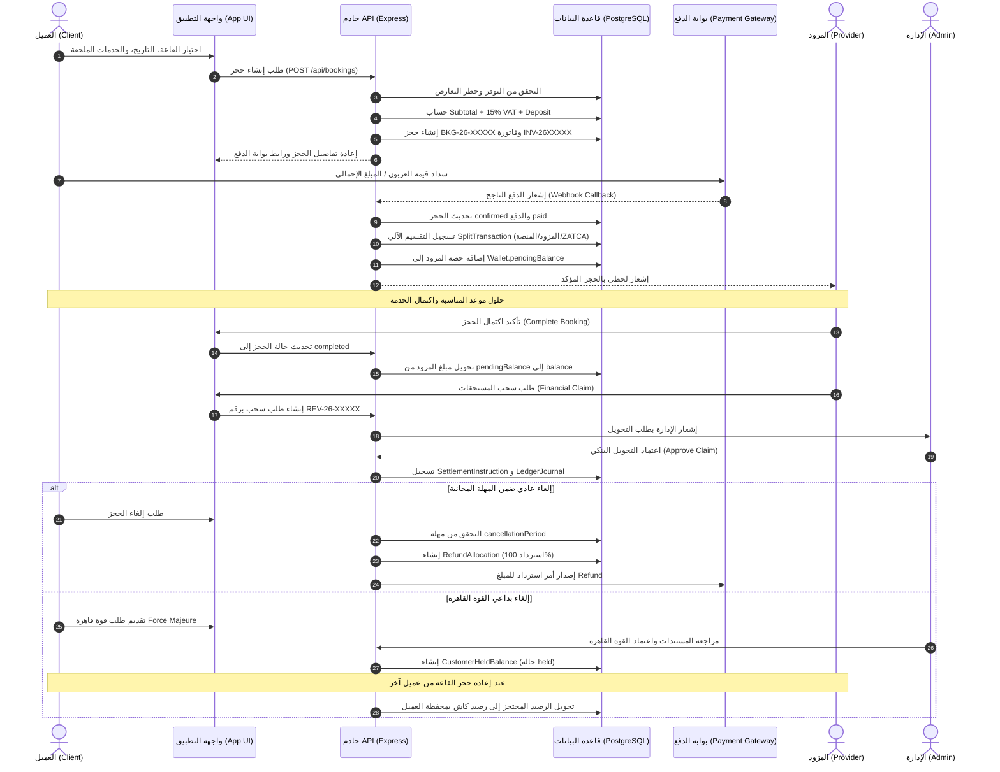
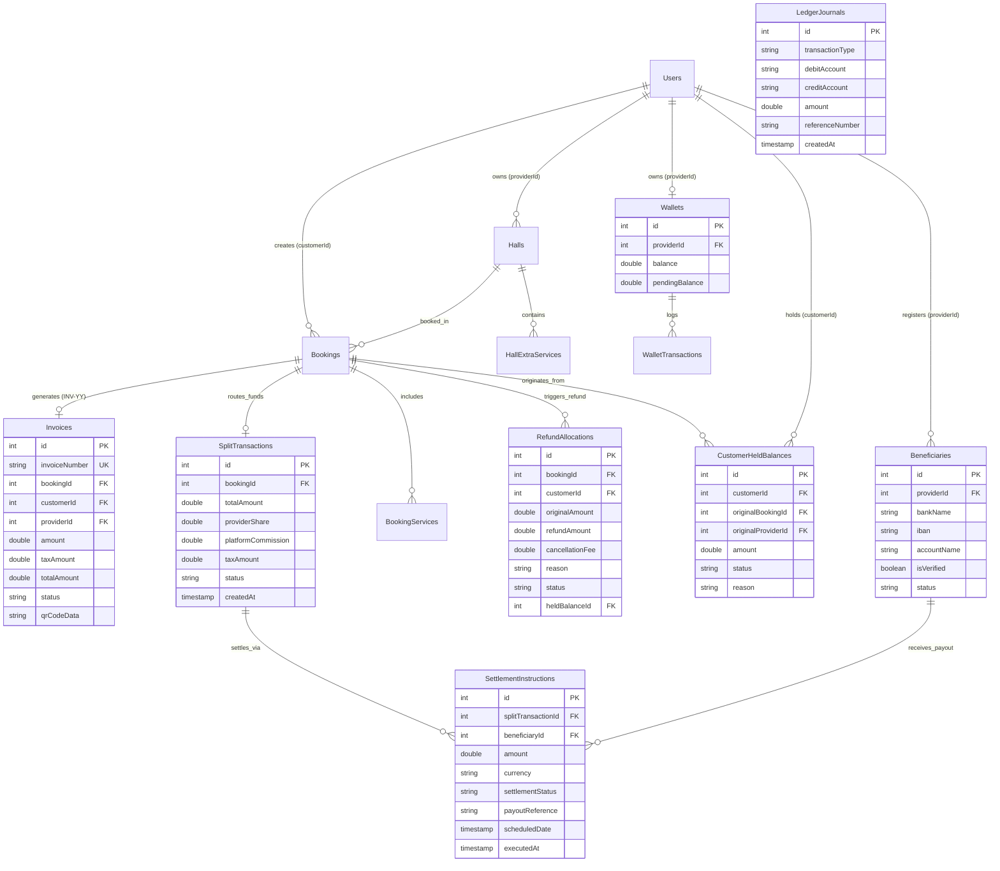

# الدليل المرجعي الشامل والمتكامل لمنصة "ليلة" الملكية 📱💻👑
*(Lailah Platform Master System Architecture, User Flows, Financial Routing, Pricing Models, Admin Panel & Provider Dashboard Documentation)*

يقدم هذا المستند توثيقاً فنياً، إدارياً، وتشغيلياً كاملاً وشاملاً لكافة مكونات وأقسام وشاشات وتدفقات العمل والصلاحيات والهندسة المالية ونماذج التسعير لمنصة **"ليلة"** الملكية (الويب وتطبيقات الجوال). يُعد هذا الدليل المرجع السياسي والبرمجي الأعلى المعتمد لتصميم، بناء، وتشغيل المنصة، ولوحة تحكم الإدارة، ولوحة تحكم الشركاء/المزودين، وتطبيقات العملاء.

---

## 📑 فهرس محتويات الدليل الشامل

1. **الهوية البصرية والسمات اللونية الملكية (Visual Identity & Theme Architecture)**
2. **هيكلية الأدوار ومصفوفة الصلاحيات السيادية (Role-Based Access Control - RBAC)**
3. **رحلة العميل وواجهات مستخدم منصة ليلة (Client Interface & User Flows)**
4. **لوحة تحكم الشريك والمزود بالتفصيل الكامل (Partner / Provider Dashboard)**
5. **لوحة تحكم الإدارة العليا والقطاعات الإدارية (Admin Control Panel & Departments)**
6. **دليل تدفقات الحجز وطلبات الخدمات المساندة (Booking & Service Request Workflows)**
7. **الهندسة المالية والتقسيم الآلي والاسترداد والقوة القاهرة (Financial Routing, Refunds & Force Majeure)**
8. **نماذج التسعير، التسعير الديناميكي، والعروض والتسويق (Pricing Models, Dynamic Surge, Discounts & Marketing)**
9. **مخطط التسلسل التفاعلي الشامل للعملية الكاملة (End-to-End Sequence Diagram)**
10. **مخطط قاعدة البيانات المالي وتوزيع الجداول (Financial Database ERD Diagram)**
11. **القواعد والسياسات الأمنية والمالية الإلزامية (Mandatory Business & Security Rules)**

---

## 🎨 1. الهوية البصرية والسمات اللونية الملكية (Visual Identity & Themes)

تم تصميم منصة "ليلة" لتقدم تجربة بصرية ملكية آسرة للأنفاس مع مساحات سلبية واسعة، ظلال ناعمة، وانتقالات في غاية الانسيابية. يدعم النظام 3 سمات لونية فاخرة:

### 1️⃣ سمة الفخامة الافتراضية (Luxury App UI - Dark Mode First)
- **الخلفية الأساسية (Canvas):** لون باذنجاني عميق جداً مائل لليلي كود `#1E141B` لراحة العين المطلقة.
- **الأسطح والبطاقات (Surfaces/Cards):** لون باذنجاني ملكي غامق كود `#2D1F28` لتمييز القوائم والبطاقات بوضوح.
- **اللون الرئيسي المميز (Primary Accent - الذهب الشمباني):** كود `#DFBA6B` للأزرار التفاعلية، النجوم، الشارات الفريدة، والعناوين الهامة.
- **اللون الثانوي المميز (Secondary Accent - العنابي/البرقوقي الوردي):** كود `#6E284D` للتأثيرات الثانوية والتحديدات والشارات المخصصة.
- **لون النصوص والأيقونات (Text & Icons):** أبيض شمباني ناعم كود `#FFF7EA` لتباين شاهق ومقروئية مثالية.

### 2️⃣ سمة الفخامة الملكية (Premium Royal Dark)
- **الخلفية الأساسية (Canvas):** كحلي داكن سحيق كود `#0F172A` أو `#121417` لمقاومة إجهاد العين بلمسة كلاسيكية غامضة.
- **اللون الذهبي الملكي (Royal Gold):** كود `#D4AF37` للأسعار، مستويات ولاء العملاء، والعمليات الحساسة.
- **تصميم أوراق الشجر الفريد (Leaf-Shape Card):** جميع الحاويات والبطاقات تصمم بحواف وزوايا مقصوصة ومقوسة برسمة ورقة الشجر المميزة (زوايا دائرية بنسبة 30% وأخرى حادة ومقصوصة بشكل هندسي مبهر).

### 3️⃣ سمة الهدوء الملكية (Premium Royal Light - قاعدة 60-30-10)
- **اللون المهيمن (60% - الخلفية والمساحات):** لون شمباني كريمي فاتح وعاجي دافئ كود `#FAF6F0` و `#FFF7EA`.
- **اللون الأساسي للعناصر (30% - البطاقات والأزرار):** البنفسجي البرقوقي العميق كود `#3B1A2F` والعنابي الملكي كود `#6E284D`.
- **لون البريق والجاذبية (10% - Highlights):** الذهبي الملكي كود `#DFBA6B` مخصص للنجوم والتقييمات والأيقونات النشطة.

---

## 👑 2. هيكلية الأدوار ومصفوفة الصلاحيات السيادية (RBAC Matrix)

يعتمد النظام نظام صلاحيات محكم ومبني على 5 أدوار رئيسية:

| م | الدور الوظيفي (Role) | اسم الدور الفني | نطاق الوصول والصلاحيات التشغيلية |
|---|----------------------|-----------------|----------------------------------|
| 1 | **إدارة المنصة السيادية** | `Admin` | الوصول المطلق لكافة القطاعات، الاعتمادات، الفواتير الموحدة، الماليات، والتهيئة |
| 2 | **مزود الخدمة / الشريك** | `provider` / `مزود` | إدارة القاعات، الحجوزات، المحفظة، الموظفين، والتقويم الخاص بمنشأته **فقط** |
| 3 | **موظف الشريك المرخص** | `provider_staff` | إدارة الحجوزات أو الاطلاع المالي بحسب الصلاحيات الممنوحة له من المزود |
| 4 | **المسوق / الوكيل** | `Marketer` | متابعة العمولات التسويقية، الرابط المرجعي، والحملات الإعلانية المرتبطة به |
| 5 | **العميل / المستفيد** | `عميل` / `Customer` | تصفح القاعات، الحجز، الدفع، إدارة المحفظة الخاصة به، الدردشة، والدعم |

### ⛔ مصفوفة حظر الصلاحيات الصارمة على المزودين (`role: provider`):
1. **حظر الإعدادات العامة للنظام (General Settings):** يُمنع المزود نهائياً من رؤية أو تعديل أي خيار يتعلق بإعدادات بوابات الدفع، شروط المنصة العامة، أو خيارات العرض القياسية.
2. **حظر الفاتورة الضريبية الموحدة (Unified Tax Invoice):** يُخفى تبويب الفاتورة الضريبية الموحدة نهائياً عن المزود، حيث يقتصر إصدارها والاطلاع عليها على الإدارة السيادية (`Admin`).
3. **حظر بيانات الشركاء الآخرين:** تُصفى كافة الاستعلامات والمحفظة والطلبات لتظهر فقط ما يطابق `providerId` الخاص بالمزود الحالي.

---

## 👤 3. رحلة العميل وواجهات مستخدم منصة ليلة (Client Interface & User Flows)

### 1️⃣ الشاشة الرئيسية والاستكشاف (Home & Discovery Screen):
- **الشريط العلوي (Header):** الترحيب بالعميل باسمه، موقع العميل الحالي (المدينة/المنطقة)، أيقونة المساعد الذكي "جيمناي (Gemini)" المتوهجة بالهالة الضوئية، وأيقونة الإشعارات.
- **البانرات الإعلانية الترويجية:** سلايدر أفقي بالتقنيات البصرية الحديثة يعرض الخصومات، الباقات الموسمية، والقاعات الرائدة.
- **سلايدر المناطق والمدن الدائري:** أزرار دائرية مخصصة لاختيار المدينة (الرياض، جدة، الشرقية، مكة، المدينة) مع أعداد القاعات المتاحة فورياً.
- **شبكة استكشاف القاعات والمنشآت:** بطاقات القاعات المصممة على شكل ورقة الشجر (`LeafCard`) تحتوي على:
  - صورة غلاف القاعة عالية الدقة (16:9).
  - شارة نوع المنشأة (أفراح، مؤتمرات، شاليه، استراحة).
  - التقييم بالنجوم وشارة الاعتماد الرسمي.
  - السعر اليومي وسعر الساعة، والعربون المطلوب.
  - زر الحفظ في المفضلة (Heart Icon).

### 2️⃣ الخريطة التفاعلية والبحث المتقدم (Explore & Map View):
- **البحث بالخريطة الجغرافية:** عرض مواقع القاعات بدبابيس تفاعلية مذهبة تحوي سعر التأجير.
- **أدوات الفلترة الدقيقة:**
  - الفلترة بالحي والمدينة.
  - الفلترة بالطاقة الاستيعابية (عدد الضيوف: من 50 حتى 1000+ ضيف).
  - الفلترة بنطاق السعر.
  - الفلترة بنوع المناسبة والتجهيزات (كوشة، إضاءة، ضيافة، توثيق وتصوير).

### 3️⃣ صفحة تفاصيل القاعة والمنشأة (Hall Details Screen):
- **معرض الصور والفيديو:** معرض صور احترافي يلتزم بالحد الأقصى (500KB للصورة) وفيديو MP4 توضيحي (حتى 10MB) بدقة 16:9.
- **بطاقة المواصفات والمميزات:**
  - الطاقة الاستيعابية، عدد الصالات (رجال / نساء)، المساحة الإجمالية.
  - الموقع الجغرافي وخيار الملاحة الفورية عبر الخرائط.
- **قسم شروط العقد والإلغاء:** عرض شروط وأحكام العقد للعميل ومهلة الإلغاء المجاني بالأيام (`cancellationPeriod`).
- **قسم الخدمات الإضافية الملحقة القاعة:** عرض خدمات الضيافة، التوثيق، والإضاءة الخاصة بالمزود.

### 4️⃣ رحلة الحجز والدفع والفوترة (Booking & Checkout Flow):
1. **اختيار التاريخ والفترة:** تقويم تفاعلي يظهر الأيام المتاحة، الفترات (`morning`, `evening`, `full_day`).
2. **اختيار الخدمات الملحقة وتطبيق التسعير الهجين:** يتيح اختيار خدمات القاعة الإضافية، ويحظر برمجياً اقتراح أي خدمات خارجية منافسة إذا كانت القاعة توفر نفس الفئة.
3. **تفصيل الفاتورة الضريبية الزكوية (VAT 15% Invoice Breakdown):**
   - السعر الأساسي للقاعة + الخدمات المختارة (`Subtotal`).
   - ضريبة القيمة المضافة بنسبة 15% (`VAT Amount`).
   - الإجمالي النهائي الشامل للضريبة (`TotalPrice`).
   - قيمة العربون الواجب سداده فوراً لتأكيد الحجز (`Deposit Amount`).
   - المتبقي لسداده بالمنشأة يوم المناسبة.
4. **بوابة الدفع الإلكترونية الآمنة:** دعم Mada, Visa, Mastercard, Apple Pay، والدفع الجزئي.
5. **توليد رقم الحجز المعياري:** إصدار المعرف `BKG-YY-XXXXXXXXXX` وتخزين الفاتورة `INV-YYXXXXXXXXXX`.

### 5️⃣ المحفظة والرصيد المحتجز والقوة القاهرة (Client Wallet & Force Majeure):
- **المحفظة الرقمية (`CustomerWallet`):** عرض الرصيد النقدي المتاح والمكتسب من الاسترجاع.
- **الرصيد المحتجز والقوة القاهرة (`CustomerHeldBalance`):** عند وقوع إقالة أو ظروف قاهرة، يودع المبلغ بحالة `held` باسم العميل. وعند إعادة حجز نفس القاعة من عميل آخر، يتحول الرصيد تلقائياً إلى كاش قابل للسحب أو الحجز مجدداً.

---

## 🏛️ 4. لوحة تحكم الشريك والمزود بالتفصيل الكامل (Partner / Provider Dashboard)

تم بناء لوحة تحكم الشريك بعزل صارم للبيانات، مما يضمن أقصى درجات الخصوصية والأمان التشغيلي:

```text
┌────────────────────────────────────────────────────────────────────────┐
│               لوحة تحكم الشريك والمزود - منصة "ليلة" للأعمال            │
├──────────────┬─────────────────────────────────────────────────────────┤
│ القائمة      │  📊 مركز العمليات التشغيلية (Operations Center)          │
│ الجانبية:    │  ┌──────────────────┐ ┌──────────────────┐ ┌──────────┐ │
│              │  │  حجوزات اليوم    │ │  إجمالي الإيراد  │ │  الإشغال │ │
│ 📊 العمليات   │  │   12 حجز مؤكد    │ │   45,000 ر.س     │ │   85%    │ │
│ 📅 التقويم   │  └──────────────────┘ └──────────────────┘ └──────────┘ │
│ 🏛️ القاعات   │                                                         │
│ 🛠️ الخدمات   │  📅 جدول الحجوزات والطلبات اليومية                      │
│ 👥 الموظفين  │  [ BKG-26-0000000001 ] - قاعة الملكية - 150,000 ر.س    │
│ 💰 المحفظة   │  [ BKG-26-0000000002 ] - قاعة الشموع  -  85,000 ر.س     │
│ 💬 المحادثات │                                                         │
│ 🎫 الدعم     │  💰 رصيد المحفظة المتاح للسحب: 120,500.00 ر.س           │
└──────────────┴─────────────────────────────────────────────────────────┘
```

### 1️⃣ مركز العمليات التشغيلية (Operations Center):
- **مؤشرات الأداء الرئيسية (KPIs):**
  - عدد الحجوزات المؤكدة لهذا الشهر.
  - إجمالي الإيرادات المالية المحققة.
  - نسبة إشغال القاعات والمنشآت.
  - الرصيد المتاح للسحب البنكي والرصيد المعلق.

### 2️⃣ إدارة القاعات والمنشآت (Halls Management):
- **قائمة المنشآت:** عرض جميع قاعات المزود مع حالة اعتماد كل قاعة (`pending`, `approved`, `rejected`).
- **نموذج إضافة/تعديل قاعة جديدة:**
  - إدخال البيانات الأساسية، الطاقة الاستيعابية، أسعار التأجير، والعربون.
  - رفع الصور والفيديو وفق المواصفات المعتمدة (صور حتى 500KB، فيديو MP4 حتى 10MB).
  - إرسال القاعة آلياً للاعتماد الإداري وحظر ظهورها للعملاء قبل موافقة الإدارة.

### 3️⃣ إدارة الخدمات الإضافية والتسعير الهجين (Extra Services):
- إضافة خدمات الضيافة، التوثيق والتصوير، والكوش الخاصة بالمنشأة.
- تفعيل أولوية خدمات القاعة لحجب الموردين المستقلين من نفس الفئة أثناء حجز القاعة.

### 4️⃣ التقويم والجداول التشغيلية (Smart Calendar & Bookings):
- عرض الحجوزات اليومية والشهرية في تقويم تفاعلي هجري وميلادي.
- إمكانية حظر تواريخ محددة للصيانة أو الحجوزات الخارجية اليدوية.
- إدارة حالة الحجز (تأكيد، بدء التنفيذ، إكتمال المناسبة).

### 5️⃣ المحفظة المالية وطلبات السحب (Wallet & Claims):
- **عرض الرصيد الفعلي المتاح (`balance`):** المبالغ المحصلة من الحجوزات المكتملة بعد اقتطاع عمولة المنصة آلياً بحسب باقة الاشتراك.
- **عرض الرصيد المعلق (`pendingBalance`):** مبالغ الحجوزات القادمة بانتظار حلول تاريخ المناسبة.
- **تقديم طلب سحب المستحقات (Financial Claim):** إرسال طلب تحويل الحساب البنكي المعتمد (IBAN) للإدارة بالرقم التسلسلي `REV-YY-XXXXXXXXXX`.

### 6️⃣ إدارة فريق العمل والمقاعد المرخصة (`provider_staff` & Seat Management):
- **عرض سعة المقاعد:** متابعة عدد المقاعد المستخدمة والمتاحة للموظفين بحسب باقة الاشتراك (مثال: 3 مقاعد مجانية بالباقة الأساسية).
- **إضافة موظف جديد:** إرسال دعوة لموظف ومنحه أحد الدورين الصريحين:
  - **مدير حجوزات (`booking_manager`):** إدارة التقويم والحجوزات والمحادثات بدون الاطلاع على المحفظة المالية.
  - **مراقب مالية (`financial_viewer`):** الاطلاع على المحفظة والتقارير المالية دون تعديل الحجوزات.
- **شراء مقاعد إضافية (In-App Seat Purchase):** إمكانية دفع رسم شهري ثابت لإضافة مقاعد موظفين إضافية.

---

## 👑 5. لوحة تحكم الإدارة العليا والقطاعات الإدارية (Admin Control Panel & Departments)

لوحة التحكم السيادية الشاملة لإدارة المنصة، الشركاء، المالية، والعمليات بكفاءة مطلقة:

```text
┌────────────────────────────────────────────────────────────────────────┐
│                 لوحة تحكم الإدارة العليا السيادية - منصة ليلة          │
├──────────────┬─────────────────────────────────────────────────────────┤
│ القطاعات:    │ 📊 لوحة المؤشرات التنفيذية والمالية الشاملة               │
│              │ ┌──────────────────┐ ┌──────────────────┐ ┌──────────┐ │
│ 🏢 الشركاء   │ │ إجمالي الحجوزات  │ │ إيراد عمولة المنصة│ │ القاعات  │ │
│ 🏛️ الاعتمادات│ │   1,240 حجز      │ │   380,000 ر.س    │ │  180 قاعة│ │
│ 💰 المالية   │ └──────────────────┘ └──────────────────┘ └──────────┘ │
│ 💳 الفواتير  │                                                         │
│ 📜 الاشتراكات│ 🏛️ طلبات اعتماد القاعات والخدمات الجديدة المعلقة          │
│ ⚖️ القوة القاهرة│ [طلب #104] - قاعة القصر الملكي - المزود: شركة الخليج (معلق)│
│ 🛡️ الأمان    │ [طلب #105] - خدمة ضيافة راقية   - المزود: مؤسسة النور (معلق)│
└──────────────┴─────────────────────────────────────────────────────────┘
```

### 1️⃣ إدارة الاعتمادات والتراخيص (Approvals Department):
- **مراجعة القاعات والخدمات الجديدة:** فحص بيانات القاعات والصور والفيديوهات المرفوعة حديثاً من المزودين.
- **صلاحية الموافقة والرفض:** تحويل الحالة إلى `approved` للظهور الفوري للعملاء، أو `rejected` مع إرسال سبب الرفض للمزود.

### 2️⃣ إدارة الشركاء والمستخدمين (Users & Partners Management):
- **دليل المستخدمين الموحد:** تصفح كافة الحسابات (عملاء، مزودين، مسوقين، موظفين).
- **توثيق الحسابات التجارية:** مراجعة السجلات التجارية، الحسابات البنكية (IBAN)، وتفعيل أو تعطيل الحسابات.
- **إدارة صلاحيات الموظفين الداخليين.**

### 3️⃣ إدارة باقات الاشتراكات والعمولات (Subscriptions & Commissions):
- **تحديد باقات المزودين (`subscription_plans`):**
  - **الباقة الأساسية:** رسم شهري منخفض + عمولة منصة 10% + 3 مقاعد موظفين.
  - **الباقة المتقدمة:** رسم شهري متوسط + عمولة منصة 7% + 5 مقاعد موظفين.
  - **الباقة الاحترافية:** رسم شهري كبار الموردين + عمولة منصة 5% + 10 مقاعد موظفين.
- **تتبع الاشتراكات الفعالة (`provider_subscriptions`).**

### 4️⃣ القطاع المالي والفوترة الموحدة (Finance & ZATCA Tax Invoices):
- **إصدار والاطلاع على الفاتورة الضريبية الموحدة (`INV-YYXXXXXXXXXX`):** الفواتير المتوافقة مع متطلبات هيئة الزكاة والضريبة والجمارك شاملة الـ QR Code التشفيري وضريبة 15%.
- **إدارة تقسيم المدفوعات آلياً (`SplitTransactions`):** تحويل حصة المزود لمحفظته، واحتساب عمولة المنصة السيادية، وحصر الضريبة الموردة.
- **معالجة طلبات السحب والمستحقات (Financial Claims):** اعتماد التحويلات البنكية للمزودين وإصدار سند الإيراد `REV-YY-XXXXXXXXXX` أو المصروف `EXP-YY-XXXXXXXXXX`.

### 5️⃣ إدارة القوة القاهرة وإلغاء الحجوزات (Force Majeure & Disputes):
- مراجعة طلبات الإلغاء بداعي القوة القاهرة.
- تحويل المبالغ لرصيد محتجز باسم العميل `CustomerHeldBalance`.
- متابعة إعادة حجز القاعة وتحويل الرصيد آلياً لكاش قابل للسحب في محفظة العميل.

### 6️⃣ القطاع التسويقي والوكالات (Marketing & Agencies):
- إدارة الاتفاقيات ونسب العمولات مع وكالات التسويق (`AgencyAgreements`).
- تتبع الحملات الإعلانية ومصاريف التسويق (`MarketingCampaigns` & `CampaignExpenses`).

### 7️⃣ سجلات الأمان والنظام (Security, Audit Logs & System Settings):
- **سجل العمليات القيادي (`AuditLogs`):** تتبع كل عملية تغيير، اعتماد، أو تحويل مالية بالاسم والتاريخ وبصمة الجهاز.
- **إعدادات بوابات الدفع والتكامل البرمجي (`SystemSettings` & `PlatformConfig`).**

---

## ⚡ 6. دليل تدفقات الحجز وطلبات الخدمات المساندة (Workflows)

### 1️⃣ تدفق حجز القاعة والمنشأة (Hall Booking Workflow):
```text
1. العميل يحدد القاعة والتاريخ والفترة (صباحية / مسائية / يوم كامل).
2. النظام يتحقق آلياً من توفر التاريخ وعدم وجود حظر أو حجز سابق.
3. العميل يختار الخدمات الملحقة المتاحة من صاحب القاعة (إن وجدت).
4. الخادم يحسب: Subtotal + VAT (15%) = TotalPrice، ويحدد العربون المطلوب Deposit.
5. إصدار الرقم المعياري BKG-YY-XXXXXXXXXX والفاتورة INV-YYXXXXXXXXXX.
6. توجيه العميل لبوابة الدفع الإلكتروني (Mada / Visa / Apple Pay).
7. عند نجاح الدفع: 
   - تتحدث حالة الحجز إلى confirmed.
   - يتولد سجل تقسيم الدفعة SplitTransaction.
   - تضاف حصة المزود إلى الرصيد المعلق pendingBalance.
   - يرسل إشعار لحظي للمزود وللعميل.
8. يوم المناسبة واكتمال الخدمة:
   - تتحدث حالة الحجز إلى completed.
   - ينتقل مبلغ المزود من pendingBalance إلى balance القابل للسحب.
```

### 2️⃣ تدفق طلب الخدمات المساندة المستقلة (Support Service Request Flow):
```text
1. العميل يتصفح قسماً مستقلاً للخدمات (مثال: مصور خارجي، سيارات زفاف، فرقة استعراضية).
2. النظام يطابق شروط عدم التداخل مع القاعة (في حال كان الحجز مرتبطاً بقاعة لها نفس الخدمة).
3. اختيار تاريخ وموعد تنفيذ الخدمة المساندة.
4. إصدار الرقم المعياري لطلب الخدمة: SRV-YY-XXXXXXXXXX.
5. دفع قيمة الخدمة وسداد الفاتورة الضريبية.
6. وصول طلب الخدمة لمزود الخدمة المساندة للقبول والتنفيذ.
```

---

## 💸 7. الهندسة المالية والتقسيم الآلي والاسترداد والقوة القاهرة (Financial Routing & Force Majeure)

تعتبر الهندسة المالية في منصة "ليلة" نظاماً سيادياً يعتمد التوجيه والتسوية والتتبع المحاسبي المزدوج (`Double-Entry Ledger`):

```text
                                  ┌───────────────────────────┐
                                  │   العميل يسدد الدفعة      │
                                  └─────────────┬─────────────┘
                                                │
                                                ▼
                                  ┌───────────────────────────┐
                                  │  بوابة الدفع الإلكترونية  │
                                  └─────────────┬─────────────┘
                                                │
                                                ▼
                                  ┌───────────────────────────┐
                                  │ جدول التقسيم الآلي        │
                                  │   SplitTransactions       │
                                  └──────┬──────┬──────┬──────┘
                                         │      │      │
                 ┌───────────────────────┘      │      └──────────────────────┐
                 ▼                              ▼                             ▼
   ┌───────────────────────────┐  ┌───────────────────────────┐  ┌───────────────────────────┐
   │    حصة المزود المستحقة    │  │   عمولة المنصة السيادية   │  │   ضريبة القيمة المضافة    │
   │  (تضاف للرصيد المعلق)     │  │  (بحسب باقة الاشتراك)     │  │      (15% ZATCA VAT)       │
   └─────────────┬─────────────┘  └───────────────────────────┘  └───────────────────────────┘
                 │
                 ▼ (عند اكتمال المناسبة)
   ┌───────────────────────────┐
   │  الرصيد المتاح للسحب      │
   │   (Wallet.balance)        │
   └─────────────┬─────────────┘
                 │
                 ▼ (تقديم طلب سحب REV-YY-XXXXXXXXXX)
   ┌───────────────────────────┐
   │ تعليمات التسوية والمصرف   │
   │ SettlementInstruction     │
   └───────────────────────────┘
```

### 1️⃣ التقسيم الآلي للمدفوعات (`SplitTransactions`):
- عند نجاح أي عملية دفع، يقوم الخادم آلياً بحساب 3 أجزاء متوافقة محاسبياً:
  1. **حصة ضريبة القيمة المضافة (`taxAmount`):** `Subtotal * 0.15` والمخصصة للتوريد المالي لـ ZATCA.
  2. **عمولة المنصة السيادية (`platformCommission`):** تحسب بناءً على نسبة باقة اشتراك المزود النشطة (`SubscriptionPlan.commissionRate`).
  3. **حصة المزود المستحقة (`providerShare`):** `TotalPaid - platformCommission - taxAmount` وتودع في `pendingBalance` بمحفظة المزود.

### 2️⃣ تعليمات التسوية والتسديد البنكي (`SettlementInstructions` & `Beneficiaries`):
- يتم توثيق الحسابات البنكية للمزودين في جدول المستفيدين المعتمدين (`Beneficiaries`) مع مطابقة الآيبان `IBAN` والاسم التجاري.
- عند تقديم المزود طلب سحب، تنشأ تعليمات تسوية (`SettlementInstruction`) بمرجع التحويل وربطها بسجل الدفتر القيادي (`LedgerJournal`).

### 3️⃣ سياسة الإلغاء والاسترداد التدريجي (`RefundAllocations` & Policies):
- **الإلغاء في مهلة الإلغاء المجاني (`bookingDate - currentDate >= cancellationPeriod`):**
  - استرداد 100% من المبلغ المدفوع لحساب العميل البنكي أو محفظة العميل (`CustomerWallet`) بدون رسوم إلغاء.
- **الإلغاء المتأخر (بعد انقضاء المهلة المجانية):**
  - اقتطاع رسوم الإلغاء المقررة بالعقد لصالح المزود والمنصة.
  - تحويل باقي المبلغ المتبقي (إن وجد) إلى محفظة العميل.

### 4️⃣ نظام القوة القاهرة والإقالة الاستثنائية (`ForceMajeureRequest` & `CustomerHeldBalance`):
- **تعريف القوة القاهرة:** الأحوال الجوية الطارئة، القرارات الحكومية السيادية، الكوارث، أو الظروف القسرية المثبتة.
- **الآلية التشغيلية:**
  1. يتقدم العميل أو المزود بطلب قوة قاهرة مرفقاً بالمستندات.
  2. تدرس الإدارة الطلب عبر لوحة التحكم وتصدر القرار.
  3. عند اعتماد القوة القاهرة: لا يُلزم المزود بإعادة المبلغ كاش فورياً إذا كان قد تجهز بها، بل يُسجل المبلغ كـ **رصيد محتجز باسم العميل** (`CustomerHeldBalance`) بحالة `held`.
  4. **تدفق إعادة الحجز التلقائي:** يتم فتح تاريخ القاعة مجدداً للحجز العام. وبمجرد حجز نفس القاعة من عميل آخر في وقت لاحق، يتحول الرصيد المحتجز آلياً إلى رصيد نقدي قابل للاستخدام في محفظة العميل الأول (`converted_to_cash`).

---

## 🏷️ 8. نماذج التسعير، التسعير الديناميكي، والعروض والتسويق (Pricing Models & Dynamic Surge)

### 1️⃣ نموذج باقات اشتراك الشركاء (Subscription Tier Pricing):
- **الباقة الأساسية (Basic Tier):** رسم شهري منخفض، عمولة منصة 10%، و3 مقاعد موظفين مجانية.
- **الباقة المتقدمة (Advanced Tier):** رسم شهري متوسط، عمولة منصة 7%، و5 مقاعد موظفين مجانية.
- **الباقة الاحترافية (Professional Tier):** رسم شهري لكبار الموردين، عمولة منصة 5%، و10 مقاعد موظفين مجانية.

### 2️⃣ نموذج التسعير الهجين والتطابق التشغيلي (Hybrid Pricing Rules):
- **حظر تداخل الخدمات الخارجية:** إذا كان مزود القاعة يقدم خدمة إضافية تندرج تحت فئة معينة (ضيافة، تصوير، إضاءة)، يُحظر برمجياً اقتراح أي مزودي خدمات خارجيين من نفس الفئة أثناء حجز القاعة لضمان أولوية البيع للمبنى ومنع التعارض التشغيلي.

### 3️⃣ التسعير الديناميكي وزيادة عطلة نهاية الأسبوع (Weekend & Seasonal Surge Pricing):
- **معدل عطلة نهاية الأسبوع (Weekend Rates):** تتيح المنصة للمزود تحديد سعر خاص لأيام الذروة (الخميس، الجمعة، السبت).
- **مواسم الذروة والأعياد (Seasonal Surge Rates):** إمكانية تطبيق نسبة زيادة مئوية أو سعر مقطوع على مواسم الأعياد (عيد الفطر، عيد الأضحى، اليوم الوطني) وحفلات الصيف.

### 4️⃣ العروض، الخصومات، والأكواد الترويجية (Offers & Promo Codes):
- **خصومات القاعات الموسمية:** إمكانية إضافة نسبة خصم مؤقتة مع عرض السعر الأصلي مشطوباً والسعر الجديد المميز.
- **كوبونات الخصم (`Promo Codes`):** تطبيق كود الخصم في شاشة الدفع واحتساب قيمة الخصم إما نسبة مئوية أو مبلغ ثابت، مع تحديد حد أقصى للخصم وتاريخ انتهاء.

### 5️⃣ التسويق، الإعلانات، والوكالات (`Marketing & Agencies`):
- **نظام المسوقين والوكلاء (`Marketer` Role):** تخصيص رابط تسويقي فريد وكود ترويجي لكل مسوق لحساب العمولات.
- **الحملات الإعلانية المأجورة (`MarketingCampaigns` & `CampaignExpenses`):** توثيق الميزانيات، النقرات، التحويلات، ومصاريف الحملات الإعلانية في لوحة التحكم الإدارية.
- **اتفاقيات الوكالات التسويقية (`AgencyAgreements`):** تنظيم نسب مشاركة أرباح المنصة مع الوكالات الإعلانية الرسمية.

---

## 🔄 9. مخطط التسلسل التفاعلي الشامل للعملية الكاملة (End-to-End Sequence Diagram)

يوضح المخطط التالي التدفق التفصيلي الشامل من لحظة تصفح العميل وحتى تسوية مستحقات المزود أو معالجة الاسترداد والقوة القاهرة:



---

## 🗄️ 10. مخطط قاعدة البيانات المالي وتوزيع الجداول (Financial Database ERD Diagram)

يوضح المخطط التالي العلاقات الهيكلية والدقيقة بين جداول التقسيم المالي، تعليمات التسوية، المحافظ، الفواتير، والأرصدة المحتجرة:



---

## 🔒 11. القواعد والسياسات الأمنية والمالية الإلزامية (Mandatory Business & Security Rules)

1. **صيغ الأرقام التسلسلية المعتمدة (تتجدد بداية كل عام ميلادي `YY`):**
   - رقم حجز القاعة: `BKG-YY-XXXXXXXXXX` (مثال: `BKG-26-0000000001`)
   - رقم طلب الخدمة المساندة: `SRV-YY-XXXXXXXXXX` (مثال: `SRV-26-0000000001`)
   - رقم الفاتورة الصادرة: `INV-YYXXXXXXXXXX` *(بدون واصلة بعد YY)* (مثال: `INV-260000000001`)
   - رقم الإيراد المالي: `REV-YY-XXXXXXXXXX` (مثال: `REV-26-0000000001`)
   - رقم المصروف المالي: `EXP-YY-XXXXXXXXXX` (مثال: `EXP-26-0000000001`)

2. **قواعد العزل الصارم لبيانات الشركاء (Multi-Tenancy Isolation):**
   - تصفية جميع الاستعلامات والمؤشرات برمجياً في الواجهة والخلفية بمطابقة `providerId`.
   - حظر وصول المزود لإعدادات النظام العامة أو الفواتير الضريبية الموحدة.

3. **قواعد التسعير الهجين والتطابق التشغيلية:**
   - إعطاء الأولوية لخدمات القاعة الداخلية، وحظر اقتراح الموردين المستقلين من نفس الفئة أثناء حجز القاعة لتفادي الازدواجية البرمجية والتعارض التشغيلي.

4. **مواصفات الوسائط المتعددة (Media Specifications):**
   - الصور: JPEG, PNG, WebP (حد أقصى 500KB للصورة، وأبعاد بين `960x540` و `1280x720` بنسبة 16:9).
   - الفيديوهات: MP4 فقط (حد أقصى 10MB وأبعاد حتى `960x540` بنسبة 16:9).

5. **الأمان والتشفير:**
   - تشفير كلمات المرور بـ `bcrypt` (Salt >= 10).
   - حماية التوكنات بـ `SecureStore` (iOS Keychain / Android EncryptedSharedPreferences).
   - توفير التحقق البيومتري (Face ID / Touch ID) وإلزامية خيار حذف الحساب الصريح وفق اشتراطات المتاجر.

---
*تم إعداد وتحديث هذا الدليل التنفيذي الشامل ليكون المرجع الفني، المالي، والسياسي المكتمل لمنصة وتطبيقات "ليلة" الملكية.*
